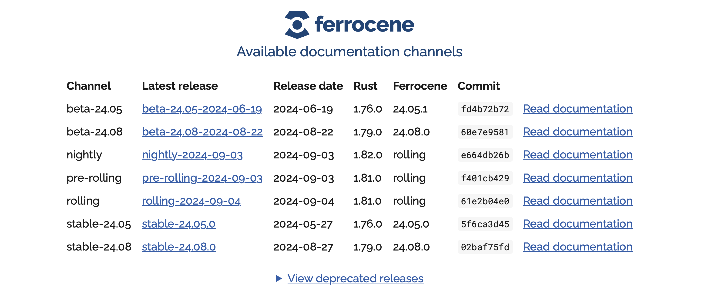

# Installing and Using Ferrocene

## What's in the box?

* `rustc` - a compiler (★)
  * `lld` - the LLVM linker (★)
  * `rustdoc` - the docs generator
* `cargo`/`rustfmt`/`clippy` - our usual friends
* `llvm-tools` - objcopy, size, etc
* `rust-analyzer` - for IDE integration
* `rust-src` - libstd source code
* `rust-std-xxx` - precompiled standard libraries (☆)
* `ferrocene-self-test` - checks your installation
* `ferrocene-docs-xxx` - documentation

★: qualified tool ☆: certification in progress

Note:

The lld linker and rustdoc come with the `rustc-${rustc-host}` package.

---


<https://releases.ferrocene.dev>

Note:

*channels* contain *releases*

Examples of channels include:

* nightly
* pre-rolling
* rolling
* beta-24.05
* beta-24.08
* stable-24.05
* stable-24.08
* etc

Examples of releases include:

* nightly-2024-08-29
* pre-rolling-2024-08-28
* rolling-2024-08-08
* beta-24.05-2024-06-19
* beta-24.08-2024-08-22
* stable-24.05.0
* stable-24.08.0
* etc

---



<https://docs.ferrocene.dev>

## Targets

We have two dimensions:

* Qualified, or not
* Host or Cross-compiled

## Qualified Targets

* Production Ready
* Passes the Rust Test Suite
* Support is available
* Signed qualification material
  * stable channel only

Note:

In stable-24.08 and earlier, these were called "Supported Targets"

Each release has a User Manual and it is important to follow the instructions
for that target in that release otherwise you may be outside the qualification
scope. As an example, we don't let you give arbitrary arguments to the linker -
you can only pass the arguments we say are OK.

## Quality Managed (QM) Targets

* Production Ready
* Passes the Rust Test Suite
* Support is available
* ~~Signed qualification material~~

Note:

It may be that the target is en-route to being a Qualified Target, or it may be
that it is deemed unlikely that the target would be useful in a safety critical
context. Talk to us if you would like a QM Target available as a Qualified
Target.

## Experimental Targets

* Not Production Ready
* Not qualified
* Might not pass the test suite
* But useful for getting started early

Note:

A Ferrocene 'Experimental Target' is broadly equivalent to an upstream Tier 2 or
Tier 1 target, depending on whether we're running the Test Suite in CI. And, to
be fair, plenty of people use upstream Rust in production.

## Host Targets

* Ferrocene runs on a limited number of hosts:
  * See [the public docs](https://public-docs.ferrocene.dev/main/user-manual/targets/index.html)
  * Or [the customer portal](https://customers.ferrocene.dev)
* Ferrocene is installed with [`criticalup`](https://criticalup.ferrocene.dev)
  * It's also [open-source](https://github.com/ferrocene/criticalup)
  * Or, you can install a specific Ferrocene release from tarballs
* Hosts always compile for themselves (proc-macros, `build.rs`, etc)

## Cross-Compilation Targets

* Compiling for a machine that is not the current host
* The list of targets increase from release to release
* See [the public docs](https://public-docs.ferrocene.dev/main/user-manual/targets/index.html)
* Or [the customer portal](https://customers.ferrocene.dev)

## Using criticalup

* Our equivalent of `rustup`
* Fetches the appropriate Ferrocene toolchain packages
  * Packages are signed with [`criticaltrust`](https://docs.rs/criticaltrust)
* Need a `criticalup.toml` file for each project, and a global login token
  * Token only required to *download* a toolchain
  * You can burn the toolchain to a CD-R if you want

## criticalup.toml

```toml
manifest-version = 1

[products.ferrocene]
release = "stable-24.08.0"
packages = [
  "rustc-${rustc-host}", "rust-std-${rustc-host}", "cargo-${rustc-host}",
  "rust-src", "rust-std-aarch64-unknown-none"
]
```

## Installing Ferrocene

1. Install [criticalup](https://criticalup.ferrocene.dev)
1. Make a [token](https://customers.ferrocene.dev/users/tokens)
1. Store your token with `criticalup auth set`
1. Go to your project dir
1. Run `criticalup install`

## Example

```console
$ criticalup auth set
$ criticalup install
info: installing product 'ferrocene' (stable-24.08.0)
info: downloading component 'cargo-x86_64-unknown-linux-gnu' for 'ferrocene' (stable-24.08.0)
...
info: downloading component 'rustc-x86_64-unknown-linux-gnu' for 'ferrocene' (stable-24.08.0)
info: installing component 'rustc-x86_64-unknown-linux-gnu' for 'ferrocene' (stable-24.08.0)
$ criticalup run rustc --version
```

## Local State

Criticalup maintains local state in one of the following locations:

* Linux: `~/.local/share/criticalup`
* macOS: `~/Library/Application Support/criticalup`
* Windows: `%APPDATA%\criticalup`

## Running Ferrocene

---

You can execute the tool directly from the install dir

```console
$ criticalup which rustc
/home/user/.local/criticalup/toolchains/cbfe2b...21e8b/bin/rustc

$ /home/user/.local/criticalup/toolchains/cbfe2b...21e8b/bin/rustc --version
rustc 1.79.0 (02baf75fd 2024-08-23) (Ferrocene by Ferrous Systems)
```

NB: `cargo` uses whichever `rustc` is in your PATH.

---

You can use the tool proxies:

```console
$ ls /home/user/.local/criticalup/bin
cargo       rust-gdb    rust-gdbgui rust-lldb   rustc       rustdoc

$ /home/user/.local/criticalup/bin/rustc --version
rustc 1.79.0 (02baf75fd 2024-08-23) (Ferrocene by Ferrous Systems)
```

NB: `cargo` uses the corresponding `rustc`

---

You can use criticalup as a proxy:

```console
$ criticalup run rustc --version
rustc 1.79.0 (02baf75fd 2024-08-23) (Ferrocene by Ferrous Systems)
```

NB: `cargo` uses the corresponding `rustc`

## rust-analyzer in VS Code

Set `RUSTC` to tell it which `rustc` to use

```text
$ RUSTC=$(criticalup which rustc) code .

PS D:\project> $Env:RUSTC=$(criticalup which rustc)
PS D:\project> code .
```

Ensure you have the `rust-src` package installed.

---

Our Rust Training has both 32-bit and 64-bit Arm bare-metal examples:

<https://github.com/ferrous-systems/rust-training/tree/main/example-code>
